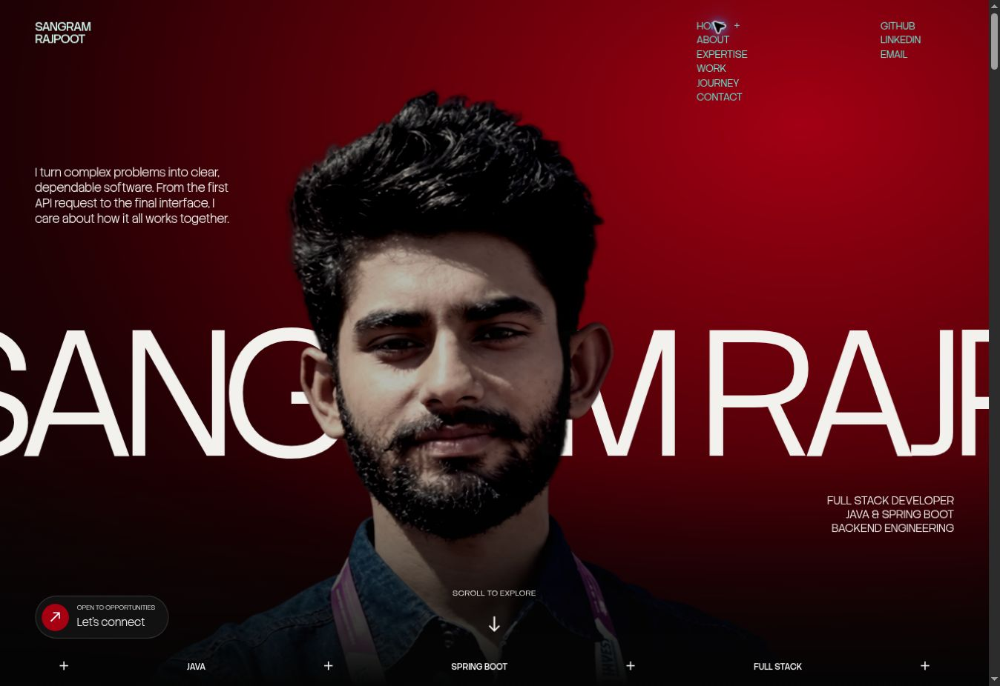

# Sangram Rajpoot — Portfolio

A responsive portfolio built with HTML, CSS, JavaScript, and Vite. The crimson and black palette, moving hero type, layered portrait, oversized section headings, and centered project displays follow the visual direction of [Meer Mohsin's portfolio](https://www.meermohsin.me/), adapted to Sangram's content.



## Development

```sh
pnpm install --frozen-lockfile
pnpm dev
```

## Production build

```sh
pnpm build
```

Deploy the generated `dist` directory. The relative asset base supports domain and subdirectory hosting. The existing root `CNAME` is retained for the current repository's hosting setup.

## Content and interactions

- Edit profile, experience, skills, and contact content in `index.html`.
- Edit project dialog content and project links in `script.js`.
- The contact form retains the existing Formspree endpoint. Delivery depends on that account's configuration.
- Navigation, project dialogs, theme switching, and reduced-motion preferences are supported. Voice navigation is shown only in browsers with speech recognition and starts after the visitor requests it.
- The hero uses an AI-assisted portrait cutout derived from the supplied photo. The original, unmodified photo remains in the journey section. Replace `assets/images/portrait-cutout.webp` with a high-resolution studio cutout for a more faithful portrait.
- Motion uses a continuous text rail, portrait parallax, scroll reveals, and hover transitions. Reduced-motion preferences are respected. The reference site's WebGL models and branded 3D emblem are not reproduced.
- Stack Sans Headline and Ruthie font licenses are included in `public/licenses` and copied into the production build.
